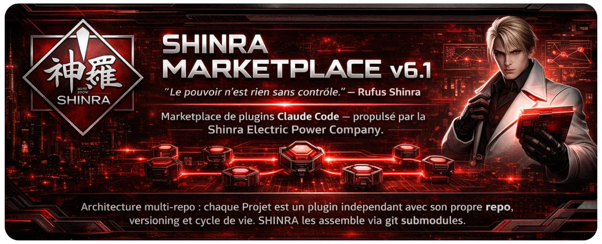

# SHINRA -- MAKO (Modular Agent Kit for Orchestration) v4.0

> *"Le pouvoir n'est rien sans controle."* -- Rufus Shinra 👔

Plugin Claude Code -- systeme multi-agents incarne par le personnel de la Shinra Electric Power Company. Concu pour un dev solo qui veut la puissance d'une equipe complete.

## Agents

| Agent | Personnage | Role | Modele |
|-------|-----------|------|--------|
| 👔 Rufus Shinra | President Shinra | **Orchestrateur** -- commande, delegue, coordonne | -- |
| 🕶️ Tseng | Chef des Turks | **Analyzer** -- scanne les projets existants, produit `project-context.md` | Sonnet |
| 💄 Scarlet | Dir. Armement Avance | **Discovery** -- comprend les besoins, selectionne la quality tier | Sonnet |
| 🏗️ Reeve | Ingenieur Shinra | **Architect** -- concoit l'architecture, decompose en Epics/Stories | Sonnet |
| 🎖️ Heidegger | Dir. Securite Publique | **Scaffold** -- cree la structure, adapte a la quality tier | Haiku |
| 🧪 Hojo | Chef Dept. Science | **Implementor** -- code les features en TDD (Red->Green->Refactor) | Opus |
| 🔥 Reno | Turk | **Tester** -- tests unitaires et integration, rapide et large | Sonnet |
| 💛 Elena | Turk (rookie) | **Tester** -- securite, edge cases, stress tests | Sonnet |
| 🍩 Palmer | Dir. Programme Spatial | **Documenter** -- genere la doc, adaptee a la quality tier | Sonnet |
| 🕶️ Rude | Turk | **Reviewer** -- review adversarial (DOIT trouver des problemes) | Sonnet |
| 🖤 Sephiroth | L'Ange Unique | **Debugger** -- auto-correction, meta-learning, soumet des PRs upstream. **VERROUILLE 🔒** | Opus |

### Sephiroth -- VERROUILLE 🔒

Sephiroth est dormant par defaut. Il ne s'active que si :
- Un agent echoue 2+ fois
- Rude rejette + le fix echoue
- Bug complexe explicite
- Modification du plugin MAKO

### Duo Reno/Elena 🔥💛

Les tests sont repartis en duo complementaire :
- **Reno** ratisse large et vite (unit + integration)
- **Elena** creuse en profondeur (securite + edge cases + stress)

## Installation

```bash
/plugin marketplace add git@github.com:Mister-Wolfgang/shinra-mako.git
/plugin install mako@shinra-marketplace
```

## Utilisation

Parlez directement a Rufus 👔 -- il analyse votre demande et delegue automatiquement aux agents concernes.

### Slash Commands

| Commande | Pipeline | Usage |
|----------|----------|-------|
| `/mako:create-project` | Scarlet -> Reeve -> **Readiness Gate** -> Heidegger -> Hojo (TDD) -> Reno -> Elena -> Palmer -> Rude | Nouveau projet from scratch |
| `/mako:modify-project` | Tseng -> Scarlet -> Reeve -> **Readiness Gate** -> Hojo (TDD) -> Reno -> Elena -> Rude | Modifier un projet existant |
| `/mako:add-feature` | Tseng -> Scarlet (stories) -> Hojo (TDD) -> Reno -> Elena -> Rude | Ajouter une feature |
| `/mako:fix-bug` | Quick Fix + **auto-escalation** -> Tseng -> Sephiroth 🔒 -> Hojo -> Reno + Elena -> Rude | Corriger un bug |
| `/mako:refactor` | Tseng -> Reeve (stories) -> **Readiness Gate** -> Hojo (TDD) -> Reno -> Elena -> Rude | Restructurer le code |
| `/mako:correct-course` | Tseng -> Rufus (3 options) -> User -> Adjust/Rollback/Re-plan | Correction mid-implementation |
| `/mako:brainstorm` | Perspectives paralleles -> Debat cible -> Spec validee | Brainstorming structure |
| `/mako:rust-security` | Tseng -> Rude (audit) -> Hojo (fix) -> Reno + Elena (tests) -> Rude | Audit securite Rust |

### Exemples

```
"Cree un jeu de snake en Python avec pygame"
"Ajoute le multiplayer en ligne"
"Le snake traverse les murs au lieu de mourir, corrige ca"
"Separe la logique du rendu"
```

## Features v4.0

### TDD Protocol 🧪

Hojo implemente chaque story en TDD : test d'abord (Red), code minimal (Green), refactor. Reno complete avec tests d'integration, Elena avec securite et edge cases -- sans duplication.

### Epic/Story Decomposition 📐

Reeve decompose chaque projet en Epics -> Stories avec criteres d'acceptation Given/When/Then, dependances explicites et estimation de complexite. Hojo implemente story par story.

### Quality Tiers 💄

Scarlet propose 4 niveaux de qualite qui se propagent a travers tous les agents :

| Tier | Scaffold | Tests | Documentation |
|------|----------|-------|---------------|
| **Essential** | Structure + deps + linter | Unitaires + integration basique | README minimal |
| **Standard** | + CI + pre-commit hooks | + Edge cases + error scenarios | + Features + API docs |
| **Comprehensive** | + Dockerfile + coverage | + E2E + load tests basiques | + docs/ folder + CONTRIBUTING |
| **Production-Ready** | + Docker multistage + deploy | + Security audit + chaos tests | + Runbooks + ADRs + CHANGELOG |

### Adversarial Review 💀

Rude **doit** trouver des problemes. Chaque finding est classifie (real/noise/undecided) avec une severite. Zero findings = re-analyse obligatoire.

### Readiness Gate 🚦

Avant toute implementation (create, modify, refactor), Rufus valide l'architecture de Reeve : coverage des features, data model, API design, contraintes, dependances. Resultat : PASS / CONCERNS / FAIL.

### Scope Escalation 🚨

Dans `fix-bug`, si Hojo detecte une complexite inattendue (3+ fichiers modifies, decisions d'architecture necessaires), le quick fix est automatiquement promu en pipeline complet avec review de Rude.

### Course Correction 🚧

`/mako:correct-course` -- quand un probleme survient mid-implementation. Tseng re-analyse, Rufus propose 3 options (Adjust / Rollback / Re-plan), l'utilisateur decide.

### Project Context 📋

Tseng produit `project-context.md` a la racine de chaque projet : tech stack, structure, conventions, decisions d'architecture, contraintes. Source de verite pour tous les agents.

### Auto-Amelioration via PR 🖤

Sephiroth ne se contente pas de corriger les erreurs -- il modifie les prompts des agents pour empecher la recurrence, puis soumet une **Pull Request** au repo upstream. Chaque utilisateur du plugin contribue ainsi a son amelioration collective.

- Modification immediate dans le cache local (effet instantane)
- PR automatique vers le repo source (branche `sephiroth/meta-<agent>-<desc>`)
- Fork automatique si l'utilisateur n'a pas les permissions de push
- Graceful degradation : si `gh` CLI absent, la modification locale reste active

## Memoire Persistante (mcp-memory-service)

MAKO integre **mcp-memory-service** -- service Python avec SQLite-Vec pour la memoire semantique persistante.

- Recherche hybride BM25 + Vector pour des resultats precis
- Knowledge graph avec visualisation D3.js (dashboard localhost:8000)
- Stockage local dans `~/.shinra/` (SQLite)
- Hook de demarrage automatique avec validation d'installation
- Seul Rufus touche la memoire -- les subagents n'y ont pas acces

## Structure

```
shinra-mako/
├── .claude-plugin/
│   └── marketplace.json
├── plugins/mako/
│   ├── .claude-plugin/
│   │   └── plugin.json
│   ├── agents/               # 10 agents Shinra (.md avec frontmatter)
│   │   ├── scarlet.md        # Discovery + Quality Tier
│   │   ├── heidegger.md      # Scaffold (tier-adapted)
│   │   ├── hojo.md           # Implementor (TDD)
│   │   ├── palmer.md         # Documentation (tier-adapted)
│   │   ├── rude.md           # Adversarial Review
│   │   ├── elena.md          # Security + Edge Case Testing
│   │   ├── reeve.md          # Architecture + Stories
│   │   ├── reno.md           # Unit + Integration Testing
│   │   ├── sephiroth.md      # Debugger + Meta-learning + PR upstream (LOCKED)
│   │   └── tseng.md          # Analyzer + project-context.md
│   ├── context/              # Orchestrateur
│   │   ├── rufus.md          # Rufus prompt principal
│   │   └── rufus-memory-guide.md
│   ├── hooks/                # Event hooks
│   │   ├── ensure-memory-server.js  # Validation + lancement mcp-memory-service
│   │   ├── inject-rufus.js          # Injection contexte Rufus
│   │   ├── pre-commit-check.js      # Verification pre-commit
│   │   └── hooks.json
│   ├── skills/               # Slash commands
│   │   ├── add-feature/
│   │   ├── brainstorm/
│   │   ├── correct-course/
│   │   ├── create-project/
│   │   ├── fix-bug/
│   │   ├── modify-project/
│   │   ├── refactor/
│   │   └── rust-security/
├── logo.png
└── README.md
```

## Git Conventions

| Prefix | Agent | Description |
|--------|-------|-------------|
| `[scaffold] 🏗️` | Heidegger | Structure initiale |
| `[impl] 🧪 story: <ST-ID>` | Hojo | Implementation TDD par story |
| `[test] 🔥` | Reno | Tests unit + integration |
| `[test] 💛` | Elena | Tests securite + edge cases |
| `[doc] 📋` | Palmer | Documentation |
| `[fix] ⚔️` | Hojo | Correction de bug |
| `[refactor] 🏗️` | Hojo | Restructuration |
| `[meta] 🖤` | Sephiroth | Modification de prompt agent (branche + PR) |

---

*Built with Claude Code + Shinra Electric Power Company* ⚔️
