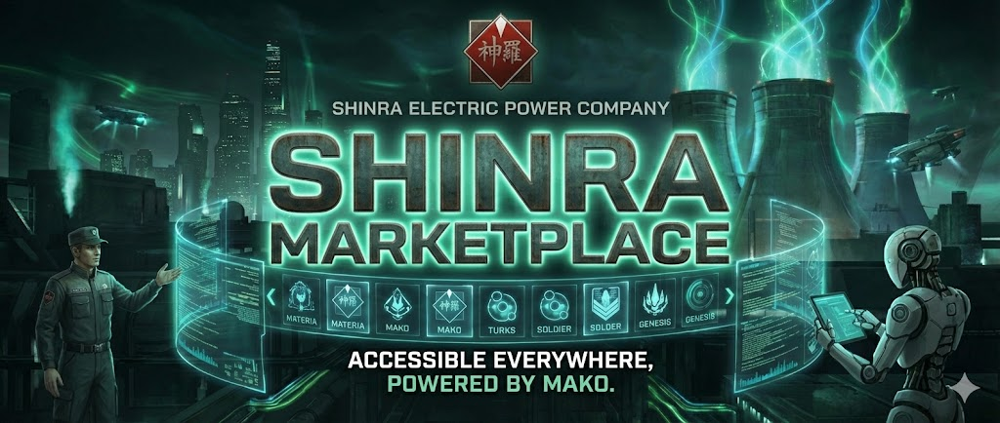

# Shinra Marketplace

> Plugin marketplace for Claude Code, operated by Shinra Electric Power Company.

## Plugins

| Plugin | Description | Version |
| --- | --- | --- |
| [MAKO](https://github.com/Mister-Wolfgang/mako-ai-agents) | Modular Agent Kit for Orchestration -- 13 AI agents for project lifecycle | 1.0.0 |

## Installation

```bash
# Add the Shinra marketplace
/plugin marketplace add git@github.com:Mister-Wolfgang/shinra-marketplace.git

# Install a plugin
/plugin install mako@shinra-marketplace
```

## Project Structure

```text
shinra-marketplace/
├── .claude-plugin/
│   └── marketplace.json
├── .gitmodules
├── projets/
│   └── mako/          # -> github.com/Mister-Wolfgang/mako-ai-agents
├── logo.jpg
└── README.md
```

## Changelog

### v1.0.0 -- Initial Release

- Marketplace architecture with Git submodules
- MAKO plugin v1.0.0
